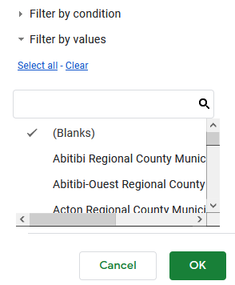
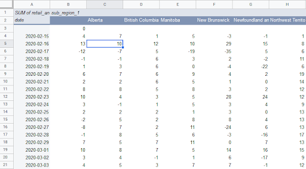
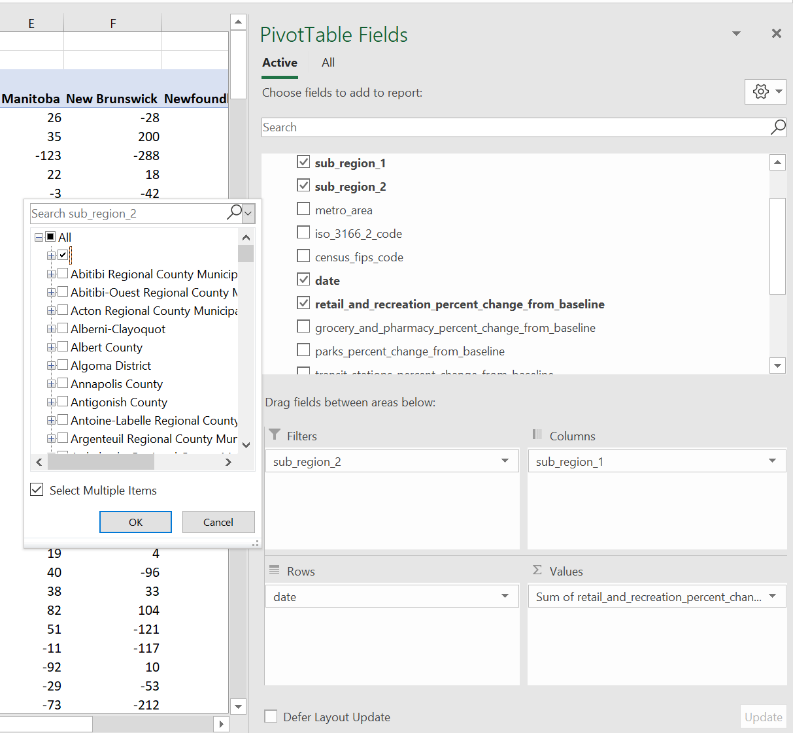
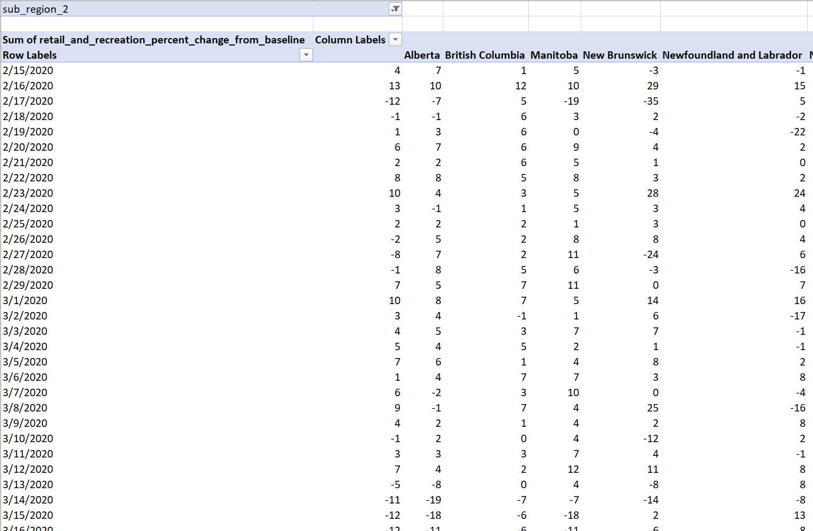

In this part, we'll reshape the data into a more usable format and perform some preliminary data visualization to examine it.

## Reshape the data to visualize it

We want to plot the retail and recreation column for each Canadian province over time. We can do this right inside the spreadsheet.

This data is in long (or tidy) format. That means that all related variables are stacked in a single column. For example, province names in a single ```sub_region_1``` column, rather than having their own columns.

Many chart tools don't work well with long data, including Google Sheets and Excel. To make a chart, we need to reshape it into wide format, with the following structure:
* One row per date
* One column per province 
* Retail and recreation numbers in the cells

To restructure the data, we will use a [Pivot table](https://support.google.com/docs/answer/1272900?hl=en). 


**Note** that the following steps are for Google Sheets; Excel  but a similar approach  (more info for [Google Sheets], [Excel](https://support.microsoft.com/en-us/office/create-a-pivottable-to-analyze-worksheet-data-a9a84538-bfe9-40a9-a8e9-f99134456576)) and the following steps:

#### In Google Sheets
* Create new pivot table (```>Data>Pivot Table```). Insert it into a new sheet.  
  
* For **Rows**, select the ```date``` column. Uncheck *Show totals*.
* For **Columns**, select the ```sub_region_1``` column. Uncheck *Show totals*.
* For **Values**, add the ```retail_and_recreation_percent_change_from_baseline``` column.
* For **Filters**, add the ```sub_region_2``` column. In the **Status** dropdown, make sure only ```(Blanks)``` is checked.
  

You now have the reshaped data ready to be piped into a chart. It should look like this:  
  

#### In Excel
* Create new pivot table (```>Insert>PivotChart>PivotChart & PivotTable```). Insert it into a *New Worksheet*.
  
* In the PivotTable Fields box, do the following: 
  * Drag the ```date``` variable to the **Rows** box. Click and remove ```date (Year)```, ```date (Quarter)```, ```date (Month)```, so that only ```date``` remains.
  * Drag the ```sub_region_1``` variable to the **Columns** box.
  * Drag the ```retail_and_recreation_percent_change_from_baseline``` variable to the **Values** box.
  * Drag the ```sub_region_2``` variable to the **Filters** box. 
  * Click the dropdown symbol beside ```sub_region_2``` in the variable list. Check the **Select Multiple Items** box, clear all check marks except for the blank entry (see below). Click OK.
    
  
* Your PivotTable Fields box should look like the following:   
    


You now have the reshaped data ready to be piped into a chart. It should look like this:  


<!-- Edit the content below for the workshop in question. Once you're ready to publish, remove the comment characters e.g. "<!--" at the start and end -->
## Content coming soon - stay tuned!

<!--

After ensuring that you've followed the [Preparatory steps](preparation), open Tableau and follow along with the workshop recording or slides. 

## Workshop recording

<iframe height="480" width="853" allowfullscreen frameborder=0 src="https://echo360.ca/media/4378b2ec-7d0c-4632-a1e4-5a8076a494da/public?autoplay=false&automute=false"></iframe>

View the original [here](https://echo360.ca/media/4378b2ec-7d0c-4632-a1e4-5a8076a494da/public).


## Workshop slides

<div style="position:relative;padding-top:66.25%;">
<iframe src="//docs.google.com/viewer?url=https://github.com/scds/intro-tableau/raw/main/assets/docs/tableau_20201118.pdf?dl=0&hl=en_US&embedded=true" class="gde-frame" style="position:absolute;top:0;left:0;width:100%;height:100%;border:none;" scrolling="no"></iframe>
</div>
[Download as a PDF](https://github.com/scds/intro-tableau/raw/main/assets/docs/tableau_20201118.pdf)
<br>

## Worksheets
**Coming soon!**


-->
