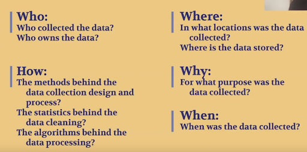

# Part 3: Scrutinize the data

**Before going any further, think about the data's flaws**

We like to think that data is truthful, that it's made of objective, hard, unfeeling numbers. This is a big misconception.

Data is created by people for specific purposes. All data exists because there was an agenda behind it. You need to understand what that agenda was to use data responsibly.

Google is pretty transparent about this data, and from the documentation we can know the following:

* The data was collected from mobile phones belonging to people with Google account and location history turned on.
* The data is the same that's used to power Google's [visit time stats on business listings](https://support.google.com/business/answer/6263531?hl=en).
* Numbers are omitted if they don't pass a certain privacy threshold, or a minimum number of people per location per date.

Now, what can this mean in terms of representation and inclusion of the data? Are low-income people without the latest smartphones included in the data? Are seniors? Are rural areas, or sparsely-populated territories fully represented? 

These questions need to be researched and answered before using the data. At the very least, these uncertainties need to be communicated honestly to your audience.

Think about making a [data biography](https://gijn.org/2017/03/27/data-biographies-getting-to-know-your-data/) for this dataset, by answering the following questions:

  

Source: Heather Krause, [Data Biographies: Getting to Know Your Data](https://gijn.org/2017/03/27/data-biographies-getting-to-know-your-data/)

|**Dimension**|**Questions/Considerations**|
|:-----|:-----|
|**Who**| Who collected the data? Who owns the data?| 
|**How**| The methods behind the data collection design and process The Statistics behind the data cleaning The algorithms behind the data processing|
|**Where**| In what locations was the data collected? Where is the data stored?|
|**Why**| For what purpose was the data collected?|
|**When**| When was the data collected?|

## Exercises
* Write a bullet-point data biography for the Google mobility data, based on what you researched. How would this affect what conclusions you can make with it?
* How would you communicate the data's uncertainty in your story?

Once you've completed the exercises, continue to [part 4](part4) to explore the data visually using Tableau.

<!-- Edit the content below for the workshop in question. Once you're ready to publish, remove the comment characters e.g. "<!--" at the start and end -->
<!--

After ensuring that you've followed the [Preparatory steps](preparation), open Tableau and follow along with the workshop recording or slides. 

## Workshop recording

<iframe height="480" width="853" allowfullscreen frameborder=0 src="https://echo360.ca/media/4378b2ec-7d0c-4632-a1e4-5a8076a494da/public?autoplay=false&automute=false"></iframe>

View the original [here](https://echo360.ca/media/4378b2ec-7d0c-4632-a1e4-5a8076a494da/public).

## Workshop slides

<iframe src="//docs.google.com/viewer?url=https://github.com/scds/intro-tableau/raw/main/assets/docs/tableau_20201118.pdf?dl=0&hl=en_US&embedded=true" class="gde-frame" style="position:absolute;top:0;left:0;width:100%;height:100%;border:none;" scrolling="no"></iframe>

[Download as a PDF](https://github.com/scds/intro-tableau/raw/main/assets/docs/tableau_20201118.pdf)
 

## Worksheets
**Coming soon!**

-->
