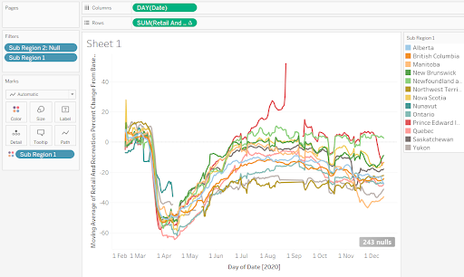

## Explore the data visually using Tableau

Now that you understand the data deeply, you can start probing it for stories with more confidence. I suggest watching some [tutorial videos](https://public.tableau.com/en-us/s/resources) of Tableau to get a basic understanding of the tool. It's not complicated to learn.

* Open Tableau Public and import the same [CSV file](https://github.com/scds/data-driven-stories/raw/main/assets/data/2020_CA_Region_Mobility_Report.csv) you imported into the spreadsheet. Refer to the video for specific steps. Tableau works well with long data, so no need to reshape it. 
* To recreate the same chart from the previous steps, drag the ```Date``` column to the **Columns** shelf. Tableau aggregates things to the largest unit, so it will group the date into years. 
Change that in the dropdown menu to the exact date.
* Drag the ```retail_and_recreation_percent_change_from_baseline``` column to the **Rows** shelf, and the ```sub_region_1``` column to the **Color** shelf. 
* Now drag ```sub_region_2``` to the **Filters** shelf and be sure to only select the **Null** (or blank) rows.  


The correct, filtered chart should look like this:  


Still as noisy as before, but it was much quicker to make! Now we'll make it easier to read using a powerful Tableau feature called a **Table Calculation**.

* Click on the drown-down menu of the **Rows** shelf and choose **Quick table calculation -> Moving average**. It will add a two-day moving average by default, slightly smoothing the lines. 
* Change the moving average to a 6-day average.
* Open the same menu and choose **Edit table calculation**. In the second menu, change the value of **Previous values** to 6, then close that window.  


You should now have smoothed lines that are much easier to read and find patterns! You might also want to drag ```sub_region_1``` to the **Filters** box and uncheck the **Null** box, so you only have lines for provinces.  



## 4. Exercises 


Once you've completed the exercises, continue to [part 3](part3) to consider the potential flaws and limitations of the data.
