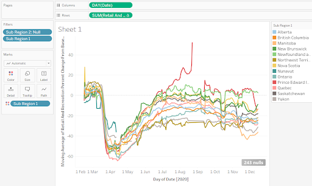
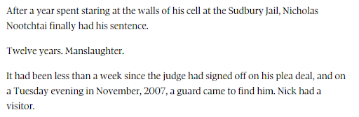
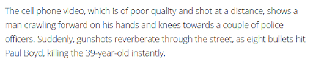

# Part 1: Build a story
In the [last part](part4), we generated the following figure and began to identify some possible angles for stories:  

Now, we'll build a story with (and around) the data.

## 1. Find corroborating evidence to support your claims
If this was a news story, all the steps up to now would really be just the start of the research. I have my story angle and I have some visuals I can include. But this isn't enough.

I may have a what, when, where and who, but I don't have a how and why, which are usually the hardest questions to answer.

I still need to bolster my story with official sources, corroborating evidence, and experts' insights. This means calling up academics in epidemiology, public policy, and behavioural psychology, for example.

And if my findings are challenged by experts, I need to go back and reframe the story, discard assumptions, and try again, with more certainty than before.

## 2. Exercise
What experts and sources would you seek to support your claims in the story? How would you look for them?

Imagine an expert challenges your findings. What would be your next step?

## 3. Humanize the numbers
At this point, you could probably write a fairly cut and dry report with a bunch of stats and quotes from experts. If your audience consists of other experts, that's fine. But if you want to draw in a general audience, you need to tell a story. And stories have characters.

Take a look at some of these data-driven stories that were created recently. They involved months of research, data collection and standardization, and painstaking analysis. But none of them opened with a statistic.

---

  
Source: [The Globe and Mail](https://www.theglobeandmail.com/canada/article-investigation-racial-bias-in-canadian-prison-risk-assessments/)

---

  
Source: [CBC News](https://newsinteractives.cbc.ca/longform-custom/deadly-force) 

---

The human brain is wired to pay attention to stories. It's how humans passed on knowledge for millenia, since we sat around a fire talking about the day's hunt.

You need to find people who are represented by the numbers, who can talk about their motivations, their conflicts, their feelings. 

This isn't meant to be a representative survey, but anecdotes that exemplify in more relatable terms what the numbers show. Of course, with anecdotes you run the risk of finding an exception to the pattern, or committing an [ecological fallacy](https://www.britannica.com/science/ecological-fallacy). This is why it's a good idea to talk to several people.

Some examples of characters you can interview, depending on the story angle you chose:  
* People from the Maritimes who are enjoying their usual activities as the rest of the country isolates at home.
* People in Manitoba who got spooked into self-isolation as case numbers soar.
* People in Quebec who describe their attitudes in the second wave compared to the first.

How do you find such people? It's never been easier with Twitter, Facebook, LinkedIn, even just asking friends and colleagues.

## 4. Exercises
Choose one of your story ideas and write a more detailed story plan:  
* Who would be your ideal characters? How would you find them?
* What questions would you ask of them that would lead to interesting and representative anecdotes?

## 5. Now, write your story 

This is where everything comes together, where you assemble your takeaways, supporting evidence and interviews into a compelling narrative. 

## 6. Exercise
* Write a first paragraph that would draw people in with a human anecdote.
* Write a detailed outline of the rest of your report.

Once you've completed this part, see the [Learn More](learn-more) page for more resources.

Consider joining Mr. Rocha for an in-person Q&A and drop-in session taking place from 1:00 to 3:00 pm ET on January 28, 2021. **Register [here](https://u.mcmaster.ca/dds-qa)**.
