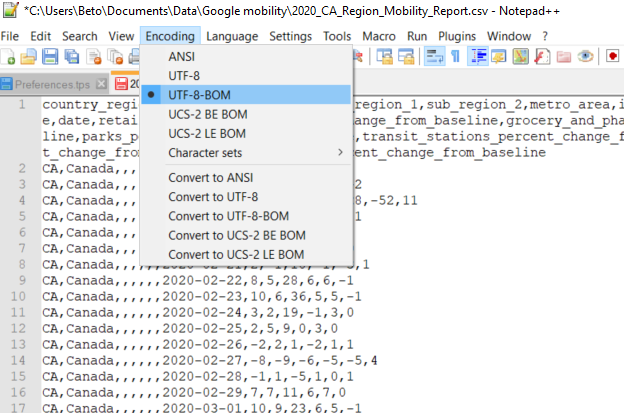
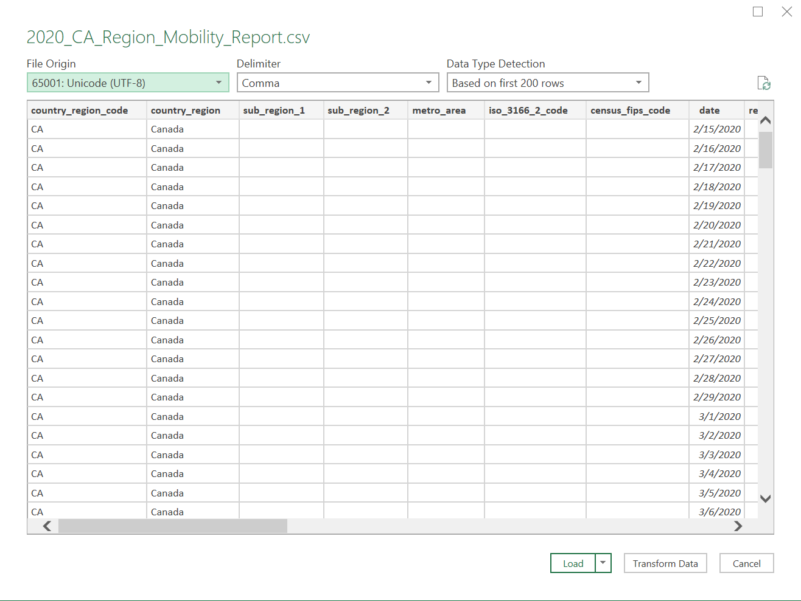

## Content coming soon - stay tuned!

# Workshop preparation 
This workshop assumes you have a basic knowledge of spreadsheets and some basic math/stats knowledge. Preparing for this workshop consists of two steps: [Getting the software](#get-the-software) and [Getting the data](#get-the-data). Follow the steps below. 
  
## Get the software
The following software is required or recommended for this tutorial: 
* [**required**] Spreadsheet software. This tutorial will use the web browser-based [Google Sheets](https://docs.google.com/spreadsheets/u/0/), though you should be able to achieve similar results with desktop programs like Microsoft Excel or [LibreOffice Calc](https://www.libreoffice.org/).
* [**required**] [Tableau Public](https://public.tableau.com/en-us/s/)--a free version of the Tableau data visualization and analysis software. 
* [**optional**] A text editor to convert the character encoding in the data file. [Notepad++](https://notepad-plus-plus.org/) is recommended for Windows, while [SublimeText](https://www.sublimetext.com/2) or [TextMate](https://macromates.com/) is recommended for Macs.

Please contact the [Sherman Centre](mailto:scds@mcmaster.ca) if you have any difficulties downloading or opening the software.
  
## Get the data
For this workshop, we'll be working with Google mobility data made available through the Google [COVID-19 Community Mobility Reports website](https://www.google.com/covid19/mobility/). 

Before downloading data, take some time to explore the website. Read the [documentation](https://www.google.com/covid19/mobility/data_documentation.html?hl=en). Understand a bit what's in the data, what to expect, how it was collected. 

You can download the dataset for this workshop by clicking on the **Region CSVs** link. It will download a zip file with detailed data for every country tracked by Google. For this workshop, we're interested only in the Canadian dataset (```2020_CA_Region_Mobility_Report.csv```). Once the file is downloaded, unzip the whole folder, or drag out the Canadian file into another folder to extract the single file. 

### A note about encoding
When you open the CSV in a spreadsheet, you may see off-looking characters in some of the columns as shown below:  
```La C��te-de-Gasp�� Regional County Municipality```

That's a character encoding issue. Spreadsheets assume an imported file has a certain character encoding, usually UTF-8. The Google data comes as UTF-8 with BOM, so this needs to be specified when you import the CSV. Follow the instructions below to import the data properly into Google Sheets and Excel: 

#### In Google Sheets
Google Sheets doesn't let you specify the encoding, so you have to re-encode the CSV in a text editor, save it, and re-import. Instead, you need to use a text editor (like [Notepad++](https://notepad-plus-plus.org/downloads/v7.9.2/)) to open the CSV file, change the encoding, and resave. 
To do this in Notepad++: 
* Open the csv file in Notepad++
* Under the **Encoding** tab, choose **UTF-8 BOM**. Save the file.


* Import the converted file in Google Sheets by opening a new Google Sheet and selecting ```File>Import``` and uploading it.

#### In Excel
In Excel, you can specify the character encoding at the time of import using the **Text/CSV** import function.
* Open a blank Excel workbook
* In the **Data** tab, select to import **From Text/CSV**
* When the import wizard appears, change the value of **File Origin** to ```650001: Unicode (UTF-8)```
* Click **Load** to import it into the spreadsheet


### If you run into trouble
If you are unable to open the csv with proper encoding, use one of the links below to get a properly encoded version: 
* [Google Sheets file](https://docs.google.com/spreadsheets/d/1IbTXQFJ4JPQB4OS2TwrUu-QpbJJl5t8Ntc40sh7udO0/copy); Click **Make a copy**.
* [Excel xlsx file](https://github.com/scds/data-driven-stories/raw/main/assets/data/2020_CA_Region_Mobility_Report.xlsx)
* The original [csv file](https://github.com/scds/data-driven-stories/raw/main/assets/data/2020_CA_Region_Mobility_Report.csv), in case you can't download it. 

Once you have the file open as a spreadsheet, proceed to [Part 1](part1) of the workshop to being exploring the data.
